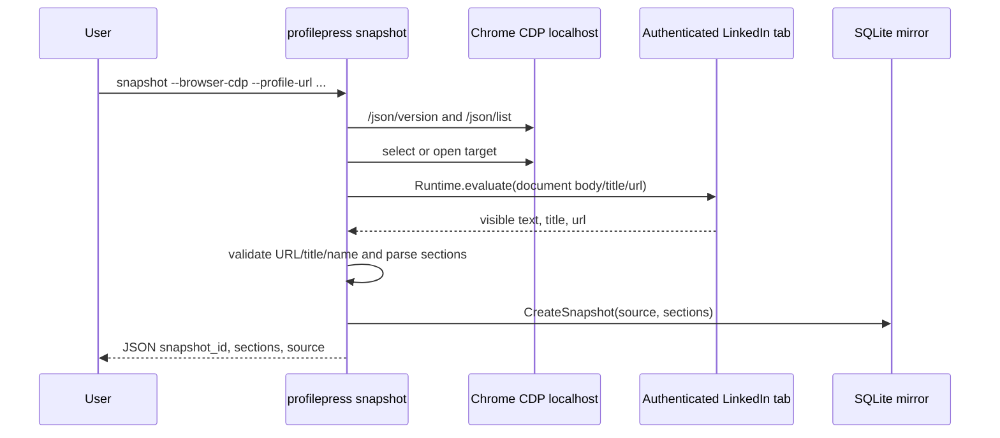

## Summary

Implement a real read-only browser snapshot path in the Printing Press-generated `profilepress` CLI. The CLI should capture LinkedIn profile text from a user-controlled authenticated Chrome/Chromium session through Chrome DevTools Protocol (CDP), parse visible profile sections, and persist them as a local snapshot for the existing propose/diff/dry-run workflow.

This keeps the product a real CLI rather than a brittle GUI steerer. It does not add live LinkedIn writes, credential capture, cookie export, message sending, or network notification.

---

## Problem Frame

`profilepress` was printed with the right command shape and safety model, but `snapshot` currently only ingests fixtures. The CLI help promises a user-controlled browser/session model, while the implementation returns `snapshot requires --fixture until browser CDP capture is configured`. That gap prevents the CLI from doing the central job: reading Michael's current authenticated LinkedIn profile before producing a rewrite packet.

---

## Requirements

- R1. `profilepress snapshot` supports a real browser-read path using a local CDP endpoint.
- R2. The browser-read path never asks for, stores, or exports LinkedIn credentials/cookies.
- R3. The command can attach to an existing tab or navigate a tab to an explicit profile URL.
- R4. Captured profile text is parsed into stable sections: headline, about, experience, education, skills, featured, activity, and raw_text when present.
- R5. The command fails closed when CDP is unavailable, the page is not LinkedIn, or captured text does not look like the requested profile.
- R6. Existing fixture snapshots keep working unchanged.
- R7. The packaged Printing Press library PR is updated from the source CLI through the publish/package workflow and remains CI-clean.

---

## Key Technical Decisions

- **CDP read adapter, not GUI steering:** Use Chrome DevTools Protocol over localhost HTTP/WebSocket so the CLI reads browser state directly instead of relying on xdotool/clipboard/screenshot behavior.
- **User-controlled browser session:** Require the user to launch Chrome/Chromium with remote debugging enabled. The CLI attaches only to the local debugging endpoint and does not manage credentials.
- **Read-only JavaScript evaluation:** Evaluate `document.body.innerText` plus `location.href` and `document.title`; do not click, submit, edit, or mutate page state.
- **Conservative validation:** Require LinkedIn URL/title and optionally expected profile name. If validation fails, error instead of snapshotting stale/wrong tab content.
- **Parser is best-effort but auditable:** Preserve full raw text as `raw_text` and derive structured sections with deterministic markers. If section extraction is thin, callers still have the raw snapshot.

---

## High-Level Technical Design

---

## Implementation Units

### U1. Add CDP client and profile text capture

**Goal:** Provide an internal read-only CDP adapter that can list targets, create/navigate a target, evaluate visible page text, and return URL/title/text.

**Requirements:** R1, R2, R3, R5

**Dependencies:** None

**Files:**
- `internal/browser/cdp.go`
- `internal/browser/cdp_test.go`
- `go.mod`
- `go.sum`

**Approach:** Add a small CDP client using localhost HTTP and WebSocket. It should support timeout-bound calls, clear errors for unreachable CDP, and a single evaluation expression returning page URL/title/body text.

**Patterns to follow:** Existing package boundaries under `internal/linkedin` and small table-driven Go tests.

**Test scenarios:**
- CDP endpoint unavailable returns an actionable error.
- Target selection prefers URL matches when available.
- Evaluation response extracts string fields from a fake CDP response.
- Timeouts do not hang the command.

**Verification:** Unit tests pass and no code path stores credentials or cookies.

### U2. Parse LinkedIn profile text into sections

**Goal:** Convert visible LinkedIn body text into deterministic profile sections while preserving raw text.

**Requirements:** R4, R5

**Dependencies:** U1

**Files:**
- `internal/linkedin/profile_text.go`
- `internal/linkedin/profile_text_test.go`

**Approach:** Normalize line-oriented text; identify common LinkedIn markers (`About`, `Experience`, `Education`, `Skills`, `Featured`, `Activity`); derive headline from lines after the profile name when possible; always include `raw_text`.

**Test scenarios:**
- Captures headline/about/experience from representative LinkedIn text.
- Handles missing optional sections by returning raw_text and available sections.
- Rejects pages that do not contain the expected profile name when supplied.
- Rejects non-LinkedIn URL/title inputs.

**Verification:** Parser tests cover happy path, missing sections, and wrong-page validation.

### U3. Wire `snapshot --browser-cdp` CLI flags

**Goal:** Make `profilepress snapshot` support fixture mode and browser-CDP mode without ambiguity.

**Requirements:** R1, R3, R5, R6

**Dependencies:** U1, U2

**Files:**
- `internal/cli/snapshot.go`
- `internal/cli/workflow_test.go`
- `README.md`
- `SKILL.md`

**Approach:** Add flags such as `--browser-cdp`, `--cdp-url`, `--profile-url`, `--target-url-match`, `--expect-name`, and `--timeout`. Fixture mode remains unchanged. Browser mode snapshots parsed sections with source metadata naming the CDP URL and page URL.

**Test scenarios:**
- Fixture mode still works.
- No fixture and no browser flag returns a helpful error.
- Browser mode with fake CDP captures a snapshot and reports section count.
- Wrong expected name fails before writing a snapshot.

**Verification:** CLI workflow tests pass and README/SKILL document how to launch Chrome with remote debugging.

### U4. Repackage and update the Printing Press library PR

**Goal:** Publish the enhanced printed CLI to both the public source repo and the Printing Press library PR.

**Requirements:** R7

**Dependencies:** U1, U2, U3

**Files:**
- Source repo generated package files.
- Library package under `library/productivity/profilepress/` after `cli-printing-press publish package`.

**Approach:** Run Go tests/build, Printing Press validate/package, copy the staged package into the library fork, preserve canonical module path in the library package, remove binary artifacts, run library verifier scripts, commit/push both repos, and monitor PR checks.

**Test scenarios:**
- Source `go test ./...` and build pass.
- `cli-printing-press publish validate` passes.
- Packaged library local tests/build pass.
- Library verify scripts pass: publish package, binary payload, supply-chain.

**Verification:** Public repo has the new commit; PR #1371 includes the enhanced CLI and all checks are green or pending external maintainer review.

---

## Scope Boundaries

### In scope

- Read-only profile capture via local CDP.
- Deterministic text section parsing and SQLite snapshot persistence.
- Updating public GitHub repo and Printing Press library PR.

### Out of scope

- Live LinkedIn profile edits.
- Cookie/token export or credential management.
- Circumventing LinkedIn auth or anti-bot systems.
- Sending messages or connection requests.
- Full DOM-specific scraping of every LinkedIn UI variant.

---

## Risks & Mitigations

- **CDP not enabled:** Return a clear setup error with a Chrome launch command.
- **Wrong tab/stale SPA content:** Validate URL/title and expected name before storing.
- **LinkedIn DOM changes:** Use visible text and raw_text fallback instead of brittle selectors.
- **Security concerns:** Do not call Network.getCookies, do not persist browser data, and keep command read-only.
- **Library PR regression:** Use the Printing Press publish/package workflow and library CI-equivalent scripts before pushing.

---

## Acceptance Criteria

- AC1. `profilepress snapshot --browser-cdp --profile-url ... --expect-name ...` can create a snapshot from a fake/test CDP server.
- AC2. Fixture snapshot behavior is unchanged.
- AC3. Wrong-profile validation fails closed.
- AC4. The existing career rewrite flow can use a real browser snapshot once Chrome is launched with remote debugging.
- AC5. Source repo and library PR are updated through the Printing Press publish/package workflow with fresh verification evidence.
